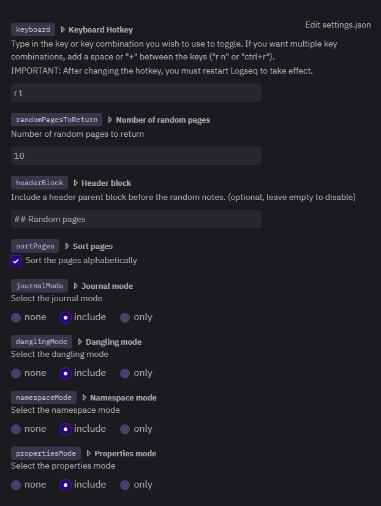

# Logseq Insert Random Pages

Logseq plugin to insert random pages as backlinks.

## Table of Contents

- [API](#api)
- [Installation](#installation)
- [Usage](#usage)
- [Features](#features)
- [Configuration](#configuration)
- [License](#license)
- [Acknowledgments](#acknowledgments)

## API

## Installation

- **Recommended** Go to the `Marketplace` in Logseq Plugins and search for `Insert Random Pages` → Click `Install`
- `Load unpacked plugin` in Logseq Desktop client.

## Usage

- **Slash Command:** Type `/` in an edit block and select "🎲 Random Note".
  - **Set count:** Optional: type the number of pages you'd like to insert before initiating the slash command.
- **Command Palette:** Open the Command Palette and select "Insert Random Pages".
- **Toolbar:** Click on the toolbar button to trigger the command.
- **Hotkey:** Use the configured hotkey (default is `r t`). After changing the hotkey in settings, restart Logseq.

## Configuration

- **Keyboard Hotkey:** Set the key combination to trigger the plugin.
- **Number of Random Pages:** Control how many random pages to return.
- **Header Block:** Provide optional header parent block text.
- **Sorting:** Enable or disable alphabetical sorting of the random pages.
- **Page Filtering:** Set modes (`none`, `include`, or `only`) for:
  - Journal pages
  - Dangling pages (pages that are referenced, but have no file)
  - Namespaces
  - Pages with page properties

## License

[LICENSE](LICENSE)

## Acknowledgments

- Built using [@logseq/libs](https://github.com/logseq/logseq-plugin-samples).
- Heavily inspired by [logseq-random-note](https://github.com/tankcool/logseq-random-note).
